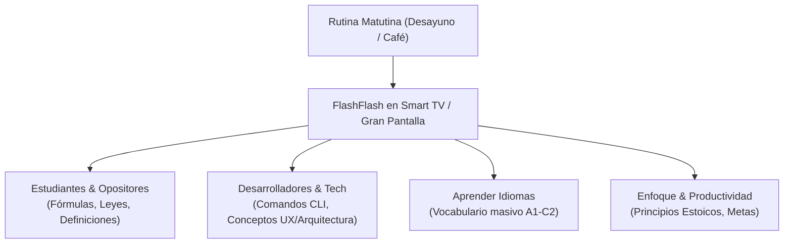

# 🎯 Propósito del Producto y Visión de Experiencia: FlashFlash

## 1. El Problema: El Dilema del Estudio Matutino
El tiempo transcurrido durante el desayuno o la rutina matutina es uno de los momentos de mayor receptividad neuro-cognitiva del día. Sin embargo, las aplicaciones tradicionales de tarjetas de memoria (*flashcards*) presentan serios obstáculos para este momento:
- **Carga Física y Táctil**: Requieren sostener un dispositivo móvil o usar el ratón/teclado de forma constante mientras se come o toma café.
- **Fatiga Visual Matutina**: Fondos blancos brillantes o pantallas pequeñas causan deslumbramiento con la luz del día y tensión en los ojos recién despiertos.
- **Distracción e Interrupciones**: La necesidad de hacer clic para evaluar cada tarjeta rompe el flujo continuo de absorción de conocimiento.

---

## 2. La Solución FlashFlash: Proyección Matutina de 10 Pies
**FlashFlash** reinventa la memorización transformando la pantalla del televisor o monitor de la habitación en un **proyector cinemático de alto rendimiento visual**.

### Pilares Fundamentales del Producto:
1. **Cero Esfuerzo Físico**: Configuras tu sesión de tarjetas en segundos desde tu smartphone o laptop (Estado A) y proyectas en la TV (Estado B).
2. **Proyección de 10 Pies (10-Foot UI)**: Diseñado para ser legible sin esfuerzo a 3 metros de distancia en una pantalla de gran formato.
3. **Modo Oscuro de Ultra Alto Contraste (16:1)**: Fondo ultra oscuro (`#121212`) con texto en blanco puro (`#FFFFFF`), evitando el cansancio de la vista matutina.
4. **Control Multimodal Discreto**: Permite ajustar la velocidad de transición (0.2s a 3.0s), pausar o cambiar de tarjeta usando el mando a distancia del televisor, teclado inalámbrico o gestos en el teléfono.

---

## 3. Perfiles de Usuario y Casos de Uso

### Casos de Uso Típicos:
* **Estudio Masivo de Vocabulario**: Repasar 50 a 100 palabras de un idioma extranjero en un bucle rápido de 3 a 5 minutos.
* **Refuerzo de Conceptos Clave**: Fijación de patrones de arquitectura de software, comandos de consola o definiciones legales.
* **Activación Mental Matutina**: Proyección de principios de diseño, citas estoicas o metas del día antes de iniciar la jornada laboral.

---

## 4. Estándares y Fundamentos UX/UI Incorporados

- **MOSIP (Modular Open Source Identity Platform) & UX4G**: Pautas universales de accesibilidad visual y claridad estructural.
- **Jakob Nielsen (10 Heurísticas de Usabilidad)**:
  - *Heurística #1 (Visibilidad del estado)*: Barra de progreso dinámica y estado de ejecución visible en el HUD.
  - *Heurística #3 (Libertad del usuario)*: Control instantáneo con atajos teclado/remotos (`Space`, `Arrows`, `Esc`).
  - *Heurística #5 (Prevención de errores)*: Parser regex que limpia entradas con comas repetidas, espacios extra o saltos de línea inútiles.
  - *Heurística #9 (Solución de errores)*: Alertas semánticas con bordes destacados ante entradas incompletas.

---
